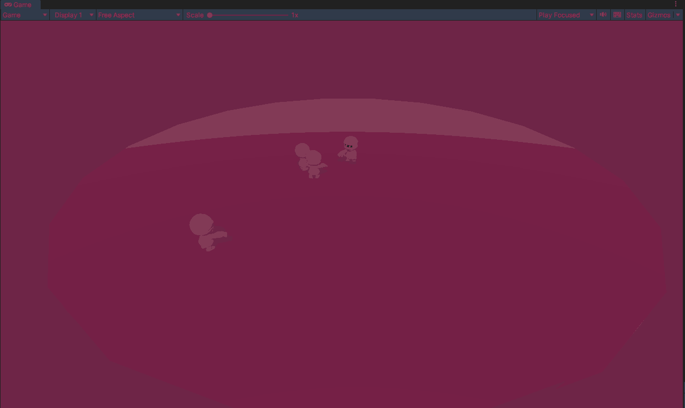

  
    
        
  

  

       CoderHouse - VideoGames With Unity
  

# CH-SceneWithVector
Lerp, y las formas de calcular direcciones.

> Consigna:
Deberás crear una escena que contenga:

    ● Un player que se mueva con inputs, y pueda rotar sobre si mismo.
    ● Un enemigo (enemigo 1) que mire al jugador siempre, con rotación suave (lerp).
    ● Un enemigo (enemigo 2) que persigue al jugador siempre, pero se detenga al estar a una distancia menor a 2 unidades.
    ● Un enemigo que pueda comportarse como el enemigo 1 o 2, según qué variable de un enum se le pase desde el inspector.

>Aspectos a incluir en el entregable:
Entregar el proyecto completo, con los scripts listos y la escena funcionando.

  
    
        
  

  

       Demo : CH-SceneWithVector
  

